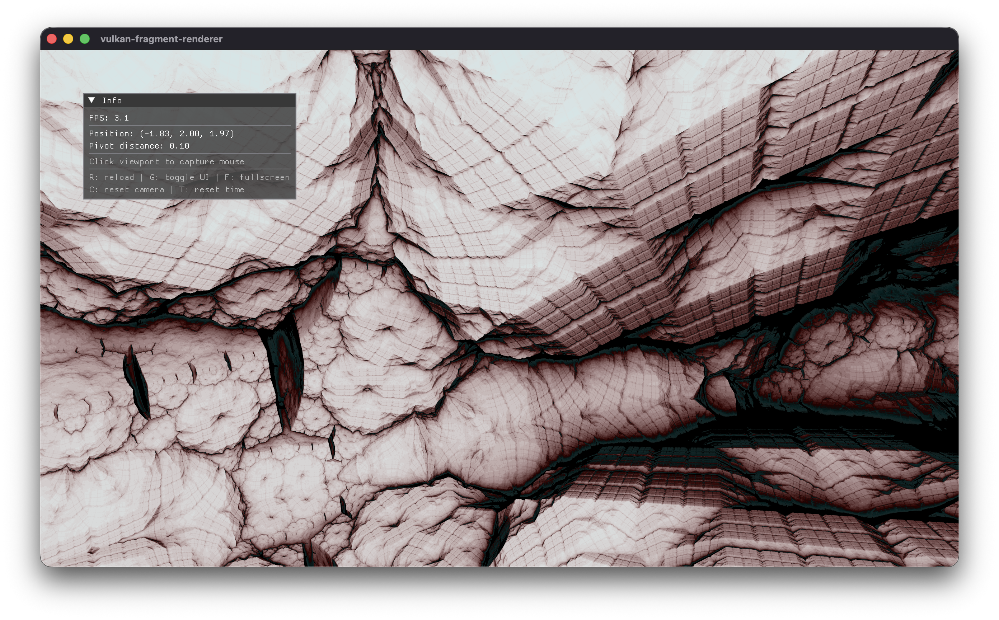

# vulkan-fragment-renderer

A real-time GLSL fragment shader viewer built on Vulkan with OpenXR HMD support. Load any fragment shader and explore it interactively with an orbit/free-look camera, or in VR with full 6DoF head tracking.

This is a port of [shader-viewer-4](https://github.com/matthewgattis/shader-viewer-4), an earlier OpenGL-based viewer. This version replaces OpenGL with the Vulkan API, adds OpenXR HMD support, and uses a descriptor set architecture for extensibility.



## Features

- **OpenXR HMD support** — stereo rendering with per-eye asymmetric frustums, 6DoF head tracking, and desktop mirror. Two-phase initialization so Vulkan can satisfy OpenXR extension requirements. Falls back gracefully to desktop-only when no HMD is detected
- **Vulkan rendering** — VMA for memory management, sRGB swapchain, per-swapchain-image semaphore synchronization, deferred GPU resource destruction
- **Depth buffer writes** — fragment shaders write `gl_FragDepth` via projection matrix, enabling compositing with geometry. In XR mode, depth is submitted to the runtime for reprojection (ASW/SpaceWarp)
- **Descriptor set architecture** — set 0 (view, projection, resolution, time) for all shaders, set 1 (precomputed inverse matrices) for ray marching. Push constants reserved for per-object model matrices
- **Runtime GLSL compilation** via shaderc with hot-reload — edit shaders and press `R` to recompile without restarting
- **Quaternion camera** — gimbal-lock-free orbit and free-look with velocity physics, friction, and pivot-distance-scaled movement
- **Dear ImGui overlay** — FPS, camera state, and controls reference

## Building

Requires CMake 3.25+, a C++23 compiler, and the Vulkan SDK.

```bash
# Bootstrap vcpkg (first time only)
./vcpkg/bootstrap-vcpkg.sh

# Configure and build
cmake --preset default
cmake --build build
```

## Usage

```bash
./build/vulkan-fragment-renderer <shader.glsl>
./build/vulkan-fragment-renderer example.glsl
./build/vulkan-fragment-renderer --low-dpi example.glsl
./build/vulkan-fragment-renderer --no-xr example.glsl   # force desktop-only
```

## Controls

| Input | Action |
|---|---|
| Left-click drag | Free-look (rotate camera in place) |
| Right-click drag | Orbit (rotate around pivot) |
| Middle-click drag | Pan |
| Both buttons drag | Zoom (forward/back) |
| Scroll wheel | Zoom |
| Ctrl + both buttons | Adjust pivot distance (mouse) |
| Ctrl + scroll | Adjust pivot distance (scroll) |
| WASD | Move (camera-relative, or HMD-relative in VR) |
| Space / Shift | Up / Down |
| R | Reload shader |
| Q | Unload shader (also releases mouse) |
| T | Reset time |
| C | Reset camera |
| G | Toggle UI |
| F / F11 | Toggle fullscreen |
| Escape | Release mouse (or quit if not captured) |

## Writing Shaders

Fragment shaders receive these inputs:

```glsl
// Set 0: common frame data (all shaders)
layout(set = 0, binding = 0) uniform FrameUbo {
    mat4 View;
    mat4 Projection;
    vec4 Resolution;  // x, y, aspect, unused
    float Time;
};

// Set 1: precomputed inverses (ray marching shaders)
layout(set = 1, binding = 0) uniform RayUbo {
    mat4 InvView;
    mat4 InvProjection;
};

// Per-object (push constant) — identity for fullscreen shaders
layout(push_constant) uniform PushConstants {
    mat4 Model;
};

// Screen coordinates from vertex shader
layout(location = 0) in vec2 FragCoord;  // (-1,-1) to (1,1)

// Output
layout(location = 0) out vec4 outColor;
```

Ray marching shaders should construct rays from the inverse matrices. This correctly handles asymmetric frustums (e.g. per-eye XR) and avoids per-fragment matrix inversion:

```glsl
vec4 eye_dir = InvProjection * vec4(FragCoord, 0.0, 1.0);
eye_dir.xyz /= eye_dir.w;
vec3 ro = InvView[3].xyz;
vec3 rd = normalize((InvView * vec4(normalize(eye_dir.xyz), 0.0)).xyz);
```

To write depth (for future compositing with geometry):

```glsl
vec3 hitPos = ro + rd * distance;
vec4 clip = Projection * View * vec4(hitPos, 1.0);
gl_FragDepth = clip.z / clip.w;
```

See `example.glsl`, `kaleidoscopic-ifs.glsl`, and `mandelbox.glsl` for complete examples.

## Architecture

| Component | Description |
|---|---|
| `engine` | Vulkan instance, device, swapchain, render passes, depth buffer, command pool, and frame synchronization. Uses VMA for memory allocation and per-swapchain-image semaphore rings for acquisition. Manages deferred GPU resource destruction. Provides decomposed frame methods (`begin_command_buffer`, `acquire_desktop_image`, `begin_desktop_render_pass`, etc.) for XR dual-path rendering. Handles swapchain recreation with `oldSwapchain` for MoltenVK compatibility. |
| `xr_session` | OpenXR HMD lifecycle via `XR_KHR_vulkan_enable`. Two-phase initialization: static `query_requirements()` runs before Vulkan setup to collect required extensions; the constructor runs after to create the XR session, per-eye swapchains, depth buffers, and render pass. Handles session state machine, frame timing, and coordinate transforms (XR pose to view matrix, asymmetric frustum projection with Vulkan Y-flip). Falls back gracefully when no HMD is detected. |
| `app` | Main loop, event dispatch, shader loading/hot-reload, and frame UBO management. Owns two descriptor sets: set 0 (frame data: view, projection, resolution, time) and set 1 (precomputed inverse matrices for ray marching). Dual render path: XR stereo with desktop mirror blit, or desktop-only. Mouse capture/release for camera control. |
| `pipeline` | Graphics pipeline creation with dynamic viewport/scissor. Accepts SPIR-V for vertex and fragment stages, descriptor set layouts, and push constant configuration. |
| `shader_compiler` | Runtime GLSL-to-SPIR-V compilation via shaderc. Enables hot-reload without an offline compilation step. |
| `camera` | Quaternion-based orbit/free-look camera with no gimbal lock. Velocity physics with friction, pivot-distance-scaled movement speed. View matrix built directly from quaternion conjugate. |
| `window` | SDL3 window management with Vulkan surface creation, high-DPI support, and automatic 4:3 resolution selection. |
| `ui` | Dear ImGui overlay with FPS, camera state, and controls reference. |

## Dependencies

Managed via vcpkg (submoduled):

- Vulkan 1.3
- VMA (Vulkan Memory Allocator)
- SDL3 (windowing, input)
- OpenXR (HMD support via `XR_KHR_vulkan_enable`, depth via `XR_KHR_composition_layer_depth`)
- shaderc (runtime GLSL to SPIR-V)
- Dear ImGui (debug UI)
- GLM (math, with `GLM_FORCE_DEPTH_ZERO_TO_ONE`)
- spdlog (logging)
- argparse (CLI)

## License

[MIT](LICENSE)
